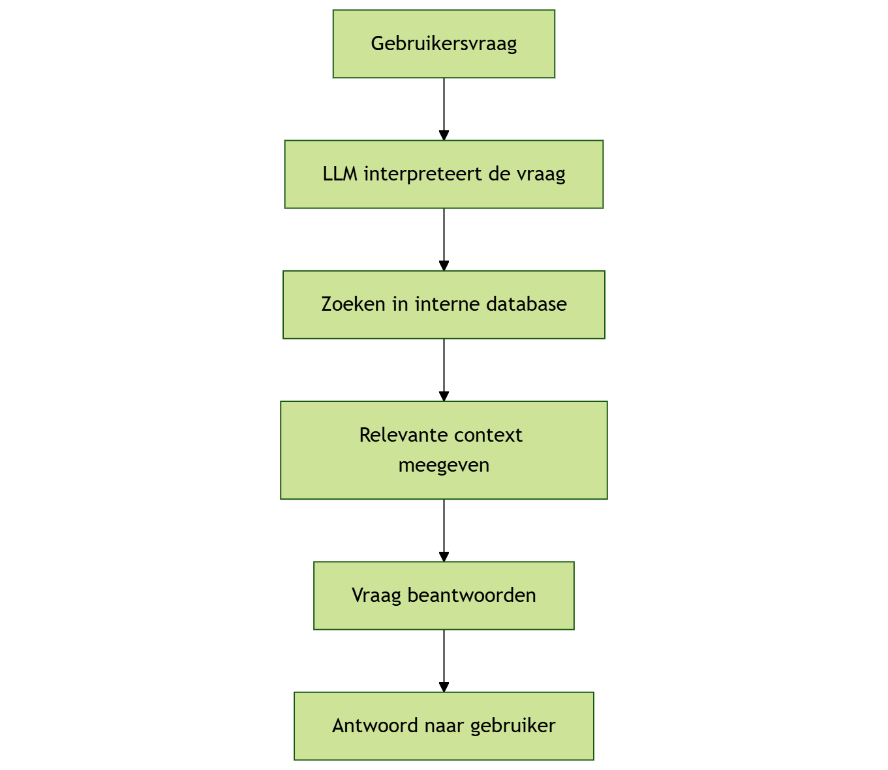
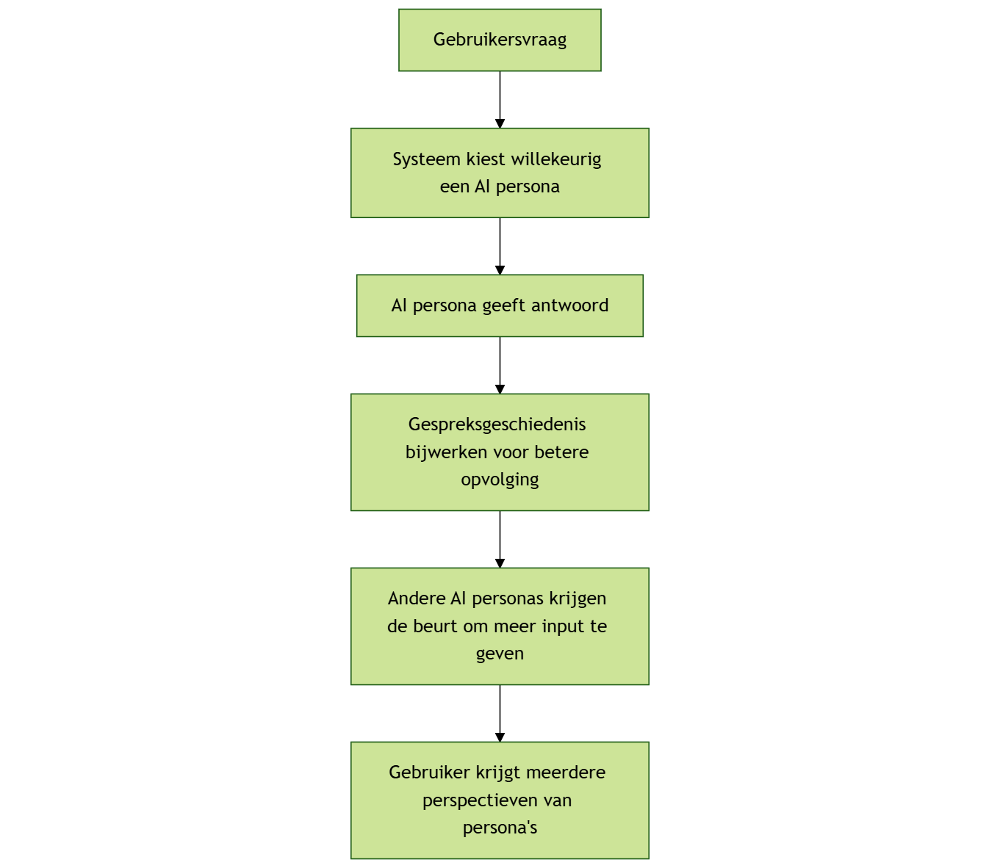

# Je eigen LLM-powered Agentic System bouwen

Nu kunnen we echt aan de slag met de opdracht. Dit document is bedoeld 
om je een stukje op weg te helpen.

## Ontwerp

De eerste stap is natuurlijk om je systeem te gaan ontwerpen. Probeer 
eerst je idee uit te schetsen voor je gaat programmeren. Hiervoor 
kun je bijvoorbeeld [MermaidJS](https://mermaid.js.org/) gebruiken om eerst een diagram te maken.

Voorbeeld van een interne onderzoeker, die gebruik maakt van een database.

Voorbeeld voor een groepschat, waar twee persona's reageren op de gebruiker 
én elkaar.

Als het duidelijk is hoe je systeem eruit moet zien, kun je gaan nadenken 
over de technische ontwerpkeuzes. Bijvoorbeeld of jullie een framework 
willen gebruiken. Probeer niet te veel tijd kwijt te zijn aan het bouwen 
van een volledige applicatie, zodat jullie ook wat tijd hebben om juist 
met AI te oefenen.

Lees ook de opdrachtbeschrijving voor de [Onderzoeker](01-researcher.md) 
of [Groepschat](01-groupchat.md) goed door.